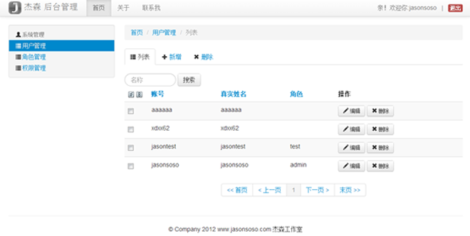

## Introduction ##

Site Background Management System --- 网站后台管理系统	
依赖两个工程包 
[JasonFramewok](https://github.com/jasonsoso/jason-framework "jason-framework")
和
[JasonSecurity](https://github.com/jasonsoso/jason-security "jason-security")
先后台管理系统暂时有权限功能和系统管理（用户管理，角色管理，权限管理）		
需要工程 
[jason-sso](https://github.com/jasonsoso/jason-sso.git "jason-sso")
跑起来，因为需要登录！呵呵。。。

## Clone and install ##

`git clone https://github.com/jasonsoso/jason-admin.git`   
`cd jason-admin`   
`mvn clean compile`   
`mvn jetty:run  ` 	

call the `http://localhost:8087` url  

## The effect ##

